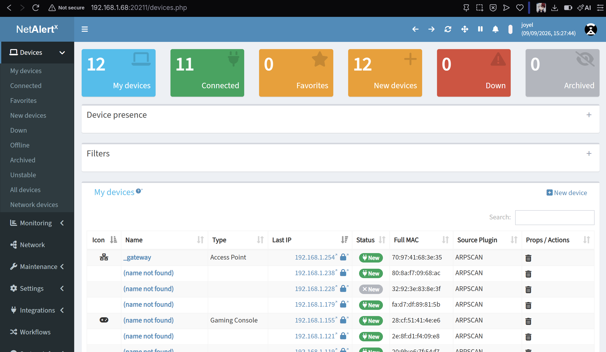
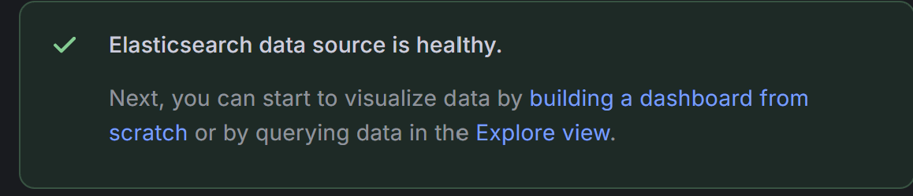
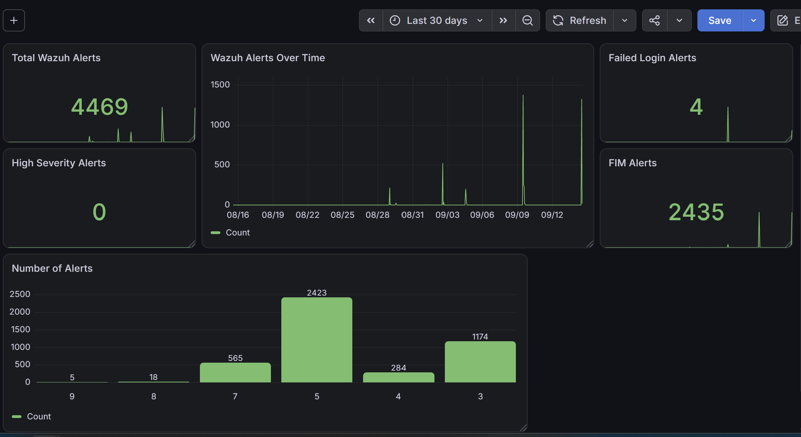

# SOC Monitoring Dashboard

## Overview

This project extends my Wazuh SIEM home lab by adding additional network visibility and security data visualisation using NetAlertX and Grafana.

Wazuh provides the underlying security telemetry and alert data, while Grafana is used to create a customised SOC monitoring dashboard. NetAlertX provides additional visibility into devices connected to the local lab network.

The project demonstrates how multiple monitoring tools can be combined to provide a more centralised view of security activity within a home SOC environment.

## Project Objectives

- Integrate Wazuh security alert data with Grafana.
- Build a customised SOC monitoring dashboard.
- Visualise security alert trends and severity levels.
- Monitor failed authentication events.
- Monitor File Integrity Monitoring (FIM) activity.
- Identify high-severity security alerts.
- Deploy NetAlertX for local network device monitoring.
- Gain practical experience integrating multiple security monitoring technologies.

## Lab Architecture

The monitoring environment consists of:

- **Windows 11 Endpoint** - Generates security telemetry and runs the Wazuh agent.
- **Ubuntu SOC Server** - Hosts Wazuh components and NetAlertX.
- **Wazuh Indexer** - Stores indexed Wazuh security alert data.
- **Grafana** - Queries Wazuh alert data and presents customised SOC visualisations.
- **NetAlertX** - Provides visibility into devices present on the local network.
- **Docker** - Provides the containerised environment used to run NetAlertX.

### Security Monitoring Flow

Windows Endpoint → Wazuh Agent → Wazuh Manager → Wazuh Indexer → Grafana Dashboard

Local Network → NetAlertX → Network Device Visibility

## Technologies Used

| Technology | Purpose |
|---|---|
| Wazuh | SIEM and endpoint security monitoring |
| Grafana | Security data visualisation and SOC dashboard creation |
| NetAlertX | Local network device discovery and monitoring |
| Docker | Containerised deployment of NetAlertX |
| Ubuntu | Hosts the SOC server components |
| Windows 11 | Monitored endpoint and Grafana host |
| VirtualBox | Virtualisation platform for the Ubuntu SOC server |
| UFW | Host-based firewall controlling access to Ubuntu services |

## NetAlertX Network Monitoring

NetAlertX was deployed in a Docker container on the Ubuntu SOC server to provide additional visibility into devices connected to the local network.

The deployment used persistent storage for NetAlertX data and host networking to support local network device discovery.

The NetAlertX interface provided visibility into discovered devices, their connectivity status, and network presence.

## Grafana and Wazuh Integration

Grafana was configured to query security alert data stored within the Wazuh Indexer.

The Wazuh alert index was added as a Grafana data source, allowing security events generated by Wazuh to be queried and transformed into custom visualisations.

The `timestamp` field was used as the time field for Wazuh alert data.

### SOC Dashboard

A custom Grafana dashboard was created to provide a central view of security activity collected by Wazuh.

The dashboard includes:

- **Total Wazuh Alerts** - Displays the overall number of alerts within the selected time range.
- **Wazuh Alerts Over Time** - Visualises changes in alert volume over time.
- **Failed Login Alerts** - Tracks Windows authentication failures.
- **FIM Alerts** - Displays File Integrity Monitoring activity.
- **High Severity Alerts** - Monitors Wazuh alerts with rule levels between 10 and 15.
- **Alerts by Severity Level** - Groups alerts by Wazuh rule level to show the distribution of alert severity.

